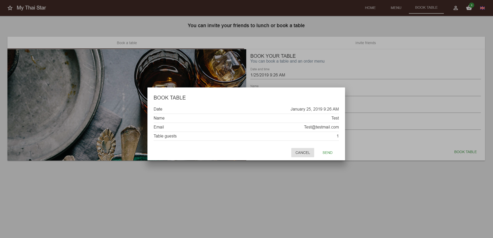

:toc: macro
toc::[]

= MrChecker Selenium Module extended guide

== Introduction
In this guide we will get into some advanced concepts for using MrChecker Selenium Module to create automated end to end tests. link:https://github.com/devonfw/devon/wiki/mrchecker-mts[Here] you can find a step by step guide on how to make a basic test.

== Structure

The architecture we use is called Page Object Model, which follows the idea of treating every page as an object and all the actions we are going to perform in said page will be methods of it. 
Typically we create a new class for every page we meet in the user story, but sometimes confirmation pages like the one in the image below can be included in the pages they are included.

//Image confirmation page
.Inspect the login icon.
[caption="Figure 1: "]

This is a good example because it could be considered as a new page, and it might be more well-organized, but considering it as a part of the booking page is also a choice when low amount of classes is desired.
It could also happen that a method in the page containing our confirmation page was also used in it and we didn't (Wouldn't??) want to duplicate it.

Then, we create a Test class which calls the previous pages and their methods in order to fulfill the user story.

=== Useful methods of BasePage class

When making a Page java class, we need to extend BasePage from MrChecker: 

[source, java]
----
import com.capgemini.mrchecker.selenium.core.BasePage;
public class HomePage extends BasePage {
  // ...
}

----

Among other very useful methods, this abstract class has three methods that we need to override:

- `pageTitle()`:  This method returns a string passed to it, where that string is normally read from a properties file. It has to be implemented like this:
[source, java]
----
  @Override
  public String pageTitle() {

    return yourPageTitle;
  }
----

- `isLoaded()`: This method returns _true_ or _false_ depending on whether or not the page is loaded. It has to be implemented like this:
[source, java]
----
  @Override
  public boolean isLoaded() {

    return getDriver().getTitle().equals(pageTitle());
  }
----

- `load()`: This method runs if isLoaded returns false. It attempts to load a Url, which is read from a properties file. It has to be implemented like this:

[source, java]
----
  @Override
  public void load() {

    getDriver().manage().window().maximize();
    getDriver().navigate().to(Url);
  }
----

There is a special method we will be using all the time: `getDriver()`, which returns a INewWebDriver object, MrChecker's variant for WebDriver objects.
We will talk about it in the following section.

There are also some useful methods you can use. Some examples are:

- `getActualPageTitle()`: This method returns as a _String_ the title of the page. It can be useful to get the title in the test instead of using `getDriver().getTitle()` in the page class.

[source, java]
----
  String expectedTitle = "My Page title";
  HomePage myHomePage = new HomePage();
  String actualTitle = myHomePage.getActualPageTitle();
  String errorMessage = "The page's title doesn't match the expected title.";
  Assert.assertEquals(errorMessage, actualTitle, expectedTitle);

----

- `refreshPage()`: This method refreshes the page. Like in the previous method, this is the test class equivalent to another method that can be used inside the page class. In this case it's `getDriver().navigate().refresh();`. It can be used like in the following code block:

[source, java]
----
  HomePage myHomePage = new HomePage();
  myHomePage.refreshPage();

----

- `openInNewTab(url)`: This method opens a specified link in a new tab, and then switches to the new tab. It can be useful if you want to conserve the current page while opening a new one, for example to compare any part of them.

[source, java]
----
  HomePage myHomePage = new HomePage();
  String url = "http://www.someurl.com";
  myHomePage.openInNewTab(url);

----

- `isElementDisplayedNoException(By selector)`: This method can be used to check if a certain element is present in a page. It can be used with any _By_, you just need to pass it the proper object.

[source, java]
----
  HomePage myHomePage = new HomePage();
	By selector = By.id("someId");
	boolean elementIsDisplayed = myHomePage.isElementDisplayedNoException(selector);
	String errorMessage = "The element is not displayed in the page.";
	Assert.assertTrue(errorMessage, elementIsDisplayed);
----

It can also be called as _isElementDisplayedNoException(By selector, WebElement parent)_ if your element doesn't have an unique property like an id or a unique class. For example:

- `isElementDisplayed(By selector)`: There is also this method where the exception isn't handled internally. This method can also be called as _isElementDisplayed(By selector, WebElement parent)_ like the previous method, or as _isElementDisplayed(By selector, String text)_ if you want to check if the element is displayed and it contains a certain text, and it can be used like this:

There is an equivalent method that can be used in page classes, _getDriver().myWebElement.isDisplayed()_, which also doesn't handle the exception and can't get a text parameter.

- `isUrlAndPageTitleAsCurrentPage(String url)`: This method checks if the url and title of the current page is as expected and returns a boolean. For that, you need to pass the expected Url and to have implemented the _pageTitle()_ method in that page class with the correct expected page title.

[source, java]
----
  HomePage myHomePage = new HomePage();
  String url = "http://www.someurl.com";
	boolean correctUrlAndTitle = myHomePage.isUrlAndPageTitleAsCurrentPage(url);
	String errorMessage = "The page url or title don't match with the expected ones.";
	Assert.assertTrue(errorMessage, correctUrlAndTitle);
----

- `navigateBack()`: This method can be used to navigate back to the previous page.
[source, java]
----
  HomePage myHomePage = new HomePage();
  myHomePage.navigateBack();
----

It can be called with a boolean parameter _true_ so it waits to make sure the page is loaded.

=== BaseTest class

Typically you divide your tests in test suites. Each test suite can be suited in one Test class including several methods with *@Test* tag that will be run when running your Test class as Junit. 

First, your Test class needs to extend BaseTest from MrChecker. Like with BasePage, you have to override two classes:

- `setUp()`: This method will be executed before starting to run the tests. Here you use the load method of the first Page in your tests. Don't forget to make your Page instance.

[source, java]
----
public class MyThaiStarTest extends BaseTest {

  private HomePage myHomePage = new HomePage();
    @Override
    public void setUp() {

      myHomePage.load();
    }
----

- `tearDown()`: This method will be executed after the tests are run, but before closing the browser. You can use it to add a wait after all tests are run, or to do any other specific action after tests are run.

[source, java]
----
  @Override
  public void tearDown() {
    try{
      int duration = 2000;
      TimeUnit.MILLISECONDS.sleep(time);
    } catch (InterruptedException e) {

      System.out.println(e);
    }
  }
----

Then you add your test methods. Remember that they won't run in the order they are in your class, to set a specific order you need to add an annotation before your Test class:
`@FixMethodOrder(MethodSorters.JVM)` if you want to run them in the order they show in the class.

`@FixMethodOrder(MethodSorters.NAME_ASCENDING)` if you want to run them in alphabetic order.

After that, in each Test method in the Test class you run the page methods to build the path described in the test case.
Below there is an example of a Test method using three pages: "HomePage", "ShopPage" and "ShoppingCartPage", where we add a product to our shopping cart, and then check out and verify if the page is asking for a payment method.

Notice that every assert has an error message; this can be very useful when trying to find out what fails after for example adding a new functionality to a Web application.

[source, java]
----
  @Test
  public void Test_BuyProduct(String productName) {

    ShopPage myShopPage = this.myHomePage.goToShopPage();
    myShopPage.addToCartAProductInTheShop(productName);
    ShoppingCartPage myCartPage = myShopPage.goToShoppingCart();
    boolean productWasAdded = myCartPage.checkIfProductWasAdded(productName);
    String shoppingCartErrorMessage = "The product wasn't added to Shopping Cart."
    Assert.assertTrue(shoppingCartErrorMessage, productWasAdded);
    myCartPage.checkout();
    boolean pageAsksForPaymentMethods = myCartPage.verifyPageAsksForPaymentMethod();
    String paymentMethodsErrorMessage = "The Payment methods dialog isn't displayed in the page."
    Assert.assertTrue(paymentMethodsErrorMessage, pageAsksForPaymentMethods);
  }
----

=== Common exceptions raised

- *BFElementNotFoundException*: The most common exception, this one is found when the element isn't in the page. Most of the time it's either a typo or that an WebElement in the DOM had that property changed since the last test run.

- *StaleElementReferenceException*: This exception happens when we defined a WebElement, but then the page was changed and we tried to interact with the same WebElement, which isn't there anymore. 
It happens no matter if the new page has a WebElement which fulfills the same criteria or not. To solve it you have to either cast the WebElement again or define a new WebElement searching it with the correct criteria, depending on whether or not there is an elemenet which fulfills the criteria.

- *WebDriverException: unknown error*: By far the most annoying exception we have found. In most of the cases it's caused by either a popup or some kind of element hiding the element you want to click. 
For example in My Thai Star's home page if you click the login button, everything other than the login dialog get obscured, the following image shows it:

.Inspect the login icon.
[caption="Figure 2: "]

Therefore if you try to click any element outside the dialog you get this error with a log like the following one:

[source, java]
----
org.openqa.selenium.WebDriverException: unknown error: Element <button _ngcontent-c2="" mat-icon-button="" name="login" class="mat-icon-button ng-star-inserted" aria-describedby="cdk-describedby-message-2" cdk-describedby-host="" style="touch-action: none; user-select: none; -webkit-user-drag: none; -webkit-tap-highlight-color: rgba(0, 0, 0, 0);">...</button> is not clickable at point (1054, 32). Other element would receive the click: 

----

This exception can also be caused if you try to interact with an element that isn't reachable for some reason. For example, in My Thai Star we found this in the following screen:

.Inspect the login icon.
[caption="Figure 3: "]

You can see in the image that the checkbox of the Angular sidenav exists even if it's not visible, so if you try to click that checkbox it will raise this exception too, as the element can't be clicked. In this case, it's very likely that either you are clicking the wrong element or you need to do something else to access to that element, like opening the sidenav.
If this keeps happening even if you do that, you can try using JavascriptExecutor:

[source, java]
----
  WebElement checkbox = getDriver().findElement(By.className("mat-checkbox-inner-container"));
  JavascriptExecutor js = (JavascriptExecutor) getDriver();
  js.executeScript("arguments[0].click()", checkbox);
----

=== getDriver() and INewWebDriver's methods

In selenium you access to the content in a page using a "WebDriver" object. With MrChecker in order to do that you need to call getDriver method, which returns a INewWebDriver object in singleton pattern.
INewWebDriver extends WebDriver, so all the methods used for classic WebDriver can be used for the object returned by getDriver method.

It's used inside page classes, where most of the actual actions will take place (for example a method that uses getDriver to enter some credentials in a login and then submit)

Some of the methods that can be used with INewWebDriver objects are:

* **findElementDynamic**: Tries to find an element by a speficied criterion. It expects a By object as argument, and returns a WebElement object. It can be used like this:

[source, java]
----
By searchElement = By.someCriterion(criterion);
getDriver().findElementDynamic(searchElement);
----

This method has an implicit wait included in it, unlike Selenium's _findElement_, so it will try to wait for the element to show up and if that never happens it will raise an exception after waiting for 20 seconds.

* Some workable **By** types:
** **By.name(someName)**
** **By.tagName(someTagName)**: For example ``By.tagName("div")`` or ``By.tagName("button")``.
** **By.className(someClassName)**: For example ``By.className("mat-checkbox")``.
** **By.id(someId)**
** **By.cssSelector(someCssSelector)**: For example ``By.cssSelector("button.mat-icon-button:nth-child(6)")`` or ``By.cssSelector("input[formcontrolname='email']")``.
** **By.xpath(someXpath)**: For example: ``By.xpath("//button[@class='text-upper property-text-bold mat-button mat-accent']")``.

* **findElementDynamics**: Unlike the previous method, this one returns a list of WebElements. It's useful when two elements share the same class or a certain property and you need to stock both of them. It raises an exception if no elements are found.

* **findElementQuietly**: Used in the same way as **findElementDynamic**, but this one doesn't raise an exception if element isn't found.

=== WebElement's methods

_findElement_ and its variants return a WebElement object. We interact with those objects using some methods. This is not a MrChecker version but the Selenium class itself so this time there aren't any new methods to talk about, just the regular methods used in Selenium. Among others, you can use:

* **myWebElement.click()**: It performs a click in the web element specified, as if the user was performing the click.

* **myWebElement.sendKeys(someString)**: It takes a string as argument and tries to type those keys in the web element. It's typically used to fill inputs, but it can be used to send specific keys like *Enter* or *Backspace*, so it can be used to activate a button (by using Enter) like if we were clicking it.

* **myWebElement.getAttribute(attributeName)**: It returns the value of that attribute.

* **myWebElement.getText()**: Returns ALL the text contained in that Web element.

* **findElement** or **findElements**: You can try to find elements inside of a particular element. While this might sound weird, think of it as trying to locate a certain button inside of a div container, for example. Here you can't use MrChecker's _findElementDynamic_ version of the method, as it's not defined for WebElements.

== Using tests from Jenkins

In order to run the tests, we have been doing it in a Jenkins container in Production line, by using a mvn test command (in the folder that contains the pom file, as usual) and making it run the test in a Selenium grid (which your Production Line instance should have). 

For this you need the Url of your Web Application to included either in your settings.properties file inside your test project or change the properties file from your Jenkinsfile 
You can read more about this link:https://github.com/devonfw/devon/wiki/mrchecker-in-production-line[here].

Also you can find link:https://km3.capgemini.com/book/1093707[here] a more extense guide on how to use it from Production Line with Allure reports.

